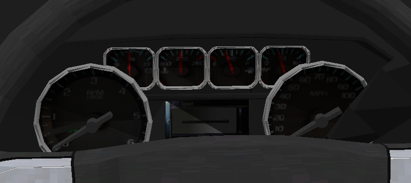

# DynamXInc - BasicsAddon

This addon adds new features to DynamX :

- Klaxon and siren
- Fuel tank
- Immatriculation plates
- Speed display on the vehicle

### How to add modules:

To add a module to your vehicle you need to edit the vehicle file inside your DynamX pack.
This file have a name like `vehicle_NAME`.

To use modules ingame you have to add specific code blocks.
Here are some examples:

#### Licenseplate

```
ImmatriculationPlate_back#Op{
  Position: 0 0 0
  Scale: 0 0 0
  Rotation: 0 0 0
  Pattern: @@ \n @@ %%%%
  LineSpacing: 0
  Color: 0 0 0
}
```

The `#Op` suffix stands for "Optional" and will remove errors when the BasicsAddon isn't loaded.

#### Lights and sounds

```
BasicsAddon#Op{
  HornSound: horn/truck
  SirenSound: sirens/truck
  TurnSignalLeftLightSource: 1
  TurnSignalRightLightSource: 2
  BrakeLightsSource: 3
  HeadLightsSource: 4
  ReverseLightsSource: 5
  DRLightsSources: 6 //Daytime running lights
}
```

The lights must then be configured accordingly with the part lights of DynamX.

#### Speed-Display

```
SpeedDisplay#Op{
  Position: 0 0 0
  Scale: 1 1 1
  Rotation: 0 0 0
  Color: 0 0 0
}
```

#### Fuel-Tank

```
FuelTank#Op{
  Position: 0 0 0
  Scale: 1 1 1
  TankSize: 80
  FuelConsumption: 1
}
```

#### Better speed-display

```
TextInfo#Op{
  Position: 0 0 0
  Scale: 1 1 1
  Rotation: 0 0 0
  Color: 0 0 0
  DetailToShow: GEAR
  CarStartedReact: True
}
```

The `DetailToShow` can be one of the following:
 - GEAR
 - SPEED
 - SPEEDLIMITOR

It will display the current gear, speed or speedlimitor value at the position.

The `CarStartedReact` can be `True` or `False` and will enable or disable the display when the car is started.

### DashboardNeedle

``` 
DashboardNeedle_2 {
    Position: 0 0 0
    Rotation: 0 0 -120
    ObjectName: speedneedle
    NeedleMaxTurn: 160
    DashboardMaxValue: 6000
    NeedleType: RPM
}
```

| Key               	| Value                                    	|
|-------------------	|------------------------------------------	|
| Rotation          	| Default rotation                         	|
| Position          	| Default position                         	|
| ObjectName        	| Name of the object in the 3D model       	|
| NeedleMaxTurn     	| Max rotation in degrees on the dashboard 	|
| DashboardMaxValue 	| Max value displayed on dashboard         	|
| NeedleType        	| It can be `RPM` or `SPEED`               	|


<br>

> Here for RPM, max DashboardMaxValue is 6000 and max NeedleMaxTurn is 160.

## Links

DynamX website: https://dynamx.fr  
Addon download: https://dynamx.fr/packs
DynamX wiki: https://dynamx.fr/wiki/
Discord: https://discord.gg/y53KGzD 
